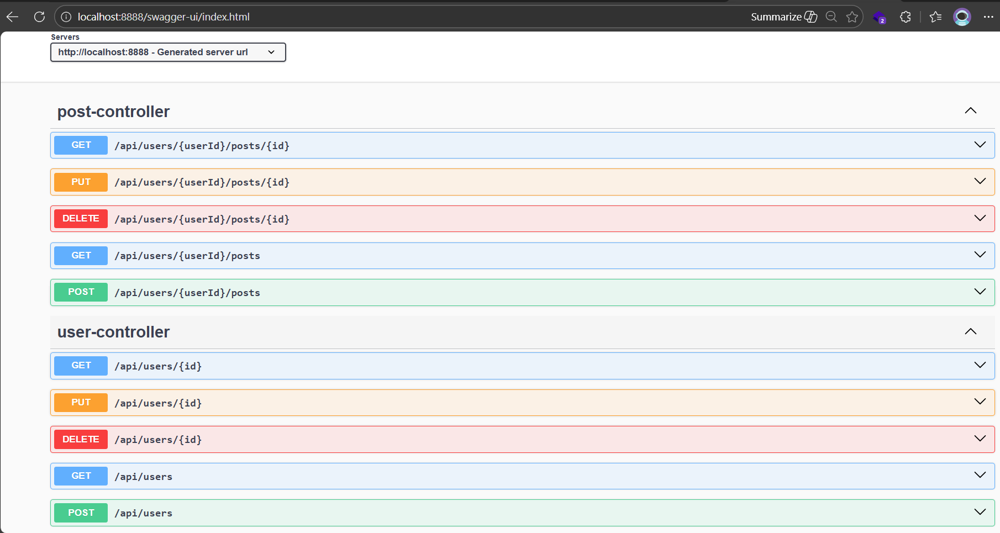
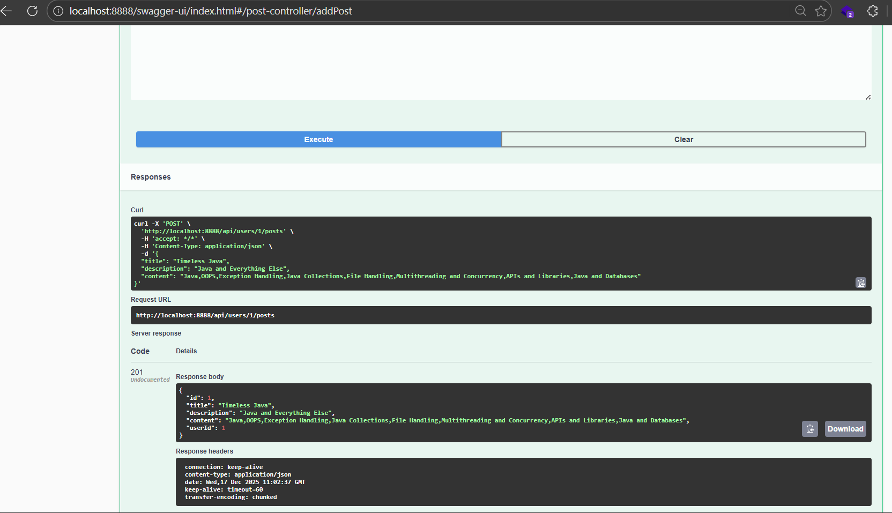
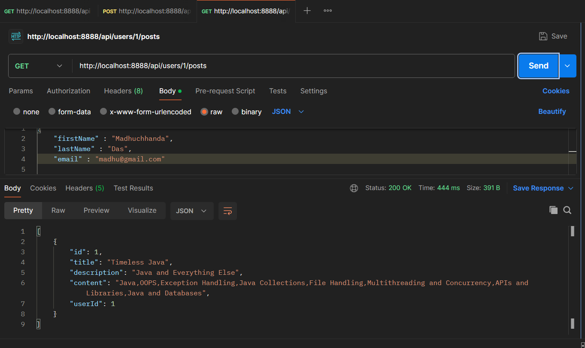
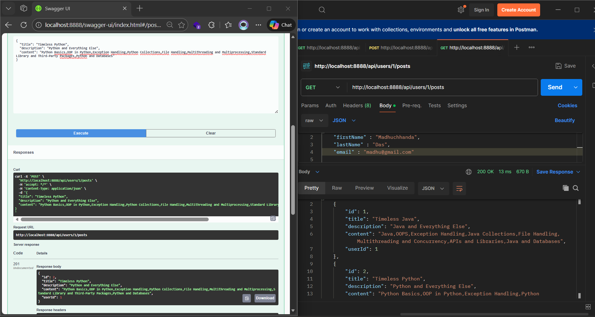

# Spring Boot One-To-Many Mapping 

This project demonstrates a **One-To-Many relationship implementation in Spring Boot using Spring Data JPA and Hibernate**.  
It is designed as a **clear learning and reference project** for understanding entity relationships, REST APIs, and database interactions.

---

## 📌 Project Overview

- Built using **Spring Boot**
- Demonstrates **One User → Multiple Posts** relationship
- Uses **JPA / Hibernate annotations**
- Exposes REST APIs for CRUD operations
- Integrated with **Swagger UI** for API documentation
- Database: **H2 / MySQL compatible**

---

## 🧩 One-To-Many Relationship Explained

In this project:

- **One User** can have **multiple Posts**
- Each Post belongs to **exactly one User**
- Relationship is mapped using:
  - `@OneToMany`
  - `@ManyToOne`
  - `@JoinColumn`

This is a **bidirectional mapping** commonly used in real-world applications like blogs, social platforms, and content systems.

---

## 🛠️ Tech Stack

- **Java**
- **Spring Boot**
- **Spring Data JPA**
- **Hibernate**
- **REST APIs**
- **Swagger (OpenAPI)**
- **H2 / MySQL**
- **Maven**

---

## 📂 Project Structure

```
springboot-one-to-many
│
├── src
│ ├── main
│ │ ├── java
│ │ │ └── com.example
│ │ │ ├── controller
│ │ │ ├── entity
│ │ │ ├── repository
│ │ │ └── service
│ │ └── resources
│ │ ├── application.properties
│
├── Output_Images
│ ├── Swagger.png
│ ├── post-oneuseronepost.png
│ ├── get-oneuseronepost.png
│ ├── oneusermultipleposts.png
│
├── pom.xml
└── README.md
```
---

## 🚀 API Endpoints Overview

The application exposes RESTful APIs organized into **User Controller** and **Post Controller**, implementing a clean **One-To-Many (User → Posts)** relationship.  
All endpoints are available and testable via **Swagger UI**.

---

### 🔹 User Controller

Handles all operations related to **User** resources.

| HTTP Method | Endpoint | Description |
|------------|---------|-------------|
| POST | `/api/users` | Create a new user |
| GET | `/api/users` | Retrieve all users |
| GET | `/api/users/{id}` | Retrieve a user by ID |
| PUT | `/api/users/{id}` | Update an existing user |
| DELETE | `/api/users/{id}` | Delete a user by ID |

---

### 🔹 Post Controller

Manages **Post** resources associated with a specific user.

| HTTP Method | Endpoint | Description |
|------------|---------|-------------|
| POST | `/api/users/{userId}/posts` | Create a post for a specific user |
| GET | `/api/users/{userId}/posts` | Retrieve all posts of a user |
| GET | `/api/users/{userId}/posts/{id}` | Retrieve a specific post of a user |
| PUT | `/api/users/{userId}/posts/{id}` | Update a specific post of a user |
| DELETE | `/api/users/{userId}/posts/{id}` | Delete a specific post of a user |

---

### 🔹 API Design Highlights

- Follows **RESTful URI design principles**
- Enforces **user–post ownership** through nested endpoints
- Supports full **CRUD operations**
- Clean separation of responsibilities between controllers

---

## 🧪 Swagger UI

Swagger is enabled for easy testing and documentation.

### 🔹 Swagger Home


---

## 📝 API Output Demonstrations

### 🔹 Create One User with One Post (POST)


---

### 🔹 Get One User with One Post (GET)


---

### 🔹 Get One User with Multiple Posts


---

## ⚙️ How to Run the Project

1. **Clone the repository**
   ```bash
   git clone https://github.com/latenightcoder-git/springboot-one-to-many.git
   ```
2. **Navigate to the project**
    ```bash
    cd springboot-one-to-many
    ```
4. **Run the application**
    ```bash
    mvn spring-boot:run
    ```
6. **Open Swagger UI**
    ```bash
    http://localhost:8888/swagger-ui.html
    ```

---
